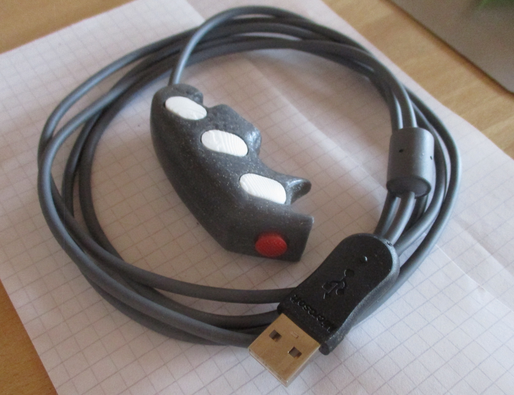

# ps2mouse-attiny85-vusb



This project is a simple adapter between a salvaged ibm-style trackpoint (which speaks PS/2), through an adafruit trinket with an Attiny85 over to usb via vusb.

running with the [micronucleous](https://github.com/micronucleus/micronucleus.git) bootloader

the firmware code itself is pulled together from the [v-usb](https://github.com/obdev/v-usb.git) hid-mouse example 
and the [interrupt based ps/2 code from here](https://github.com/trol73/avr-mouse-ps2-to-serial)


# wiring
```
                                                                           piggy-back as 0805 on the trackpoint board
                                                                           /----------------------------------------\
                                                                           |                                        |
                                                                           |                                        |
                                                                                                     Vcc --||----+          SK8707 (?)
                     Vcc                             Vcc                       Vcc                        2.2uF  |        +-------------------
                     ___                             ___                     ___ ___                             |        |
                      |               +---+           |                       |   |                  +-----------|--------+ Data
                      +---+           |   |           |    Attiny85           |   |                  |           |        |
                      |   |           |   _        +--|-----------------+     R   R  1-10k pullups   |           +--------+ Reset
                      |  1.5k        ===  ^ Red    |                    |     |   |                  |           |        |
             USB      |   |           =   |        |                    |     |   |                  |          100k      + Btn middle
         +---------+  |   |               +-470R---+ B1                 |     |   |    PS/2 Data     |           |        |
         |      5V +--+   |                        |                 B0 +-----|---|------------------+          ===       + Btn right
         |      D- +------|---68R------|-----------+ B3                 |         |                              =        |
         |      D+ +----------68R--|---|-----------+ B4              B2 +---------|---------------------------+        o--+ Btn left
         |      Gnd+--+            |   |           |                    |               PS/2 Clock            |       /   |
         +---------+  |            _   _           |                    |                                     +------- o -+ Clock
                      |            ^   ^ Z3.6   +--+ Reset              |                                Vcc           |  |
                     ===           |   |        |  |                    |                                ___       +---|--+ Gnd
                      =           === ===       o  +---------|----------+                                 |        |      |
                                   =   =       /             |                                            +--------|------+ Vcc
                                                o           ===                                                    |      |
                                                |            =                                                    ===     + NC
                                               ===                                                                 =      |
              =                                 =                 =                                                       + NC
              =                                                   =                                                       |
              =               Adafruit Trinket internal           =                                                       +-------------------
              =====================================================

```


# other useful links and references:

Trackpoint:
  https://www.reddit.com/r/MechanicalKeyboards/wiki/trackpoint/
  https://electronics.stackexchange.com/questions/155662/old-ibm-trackpoint-pin-scheme
  https://www.reddit.com/r/MechanicalKeyboards/wiki/trackpoint/
  https://github.com/joric/jorne/wiki/Trackpoint
  https://deskthority.net/wiki/TrackPoint_Hardware#2-piece_Trackpoint
  https://github.com/qmk/qmk_firmware/tree/master/keyboards/handwired/trackpoint
  https://github.com/alonswartz/trackpoint
    SK8707 module
    https://raw.githubusercontent.com/alonswartz/trackpoint/master/pinouts/ic-1-ptpm754dr.jpg
    https://raw.githubusercontent.com/alonswartz/trackpoint/master/datasheets/tpm754.pdf

Vusb:
  https://cdn-learn.adafruit.com/assets/assets/000/010/774/original/adafruit_products_trinket5.png?1378223478
  https://codeandlife.com/2012/02/22/v-usb-with-attiny45-attiny85-without-a-crystal/
